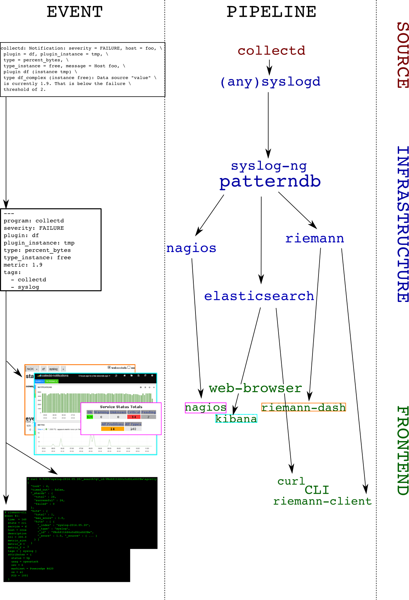

# syslog-ng, riemann, collectd-notifications, elasticsearch: putting it all together

## Context

At our organization ([CCIN2P3](http://cc.in2p3.fr)) we are building an event-based infrastructure to push structured messages to different subsystems for alerting, reporting and storage. Using *syslog-ng*, each message is normalized into a structured event, optionally correlated with other messages, and conditionally routed to the next systems, including:

* a synchronous web-dashboard,
* different asynchronous alerting systems, and
* a searchable storage backend.

The events which are collected are essentially system and application logs. Here's a few examples of interesting messages:
```
puppet-agent[16528]: Finished catalog run in 44.06 seconds
kernel: Killed process 29959, UID 42046, (hadd) total-vm:202363492kB, anon-rss:13069860kB, file-rss:60kB
ata2.00: exception Emask 0x0 SAct 0xffff SErr 0x0 action 0x0
EXT3-fs error (device dm-1): ext3_journal_start_sb: Detected aborted journal
```

The unified nature of this pipeline makes it possible for a human to easily identify an event in all the available back- and frontends.

In this post you'll learn a way to implement this model, and achieve the following:

* **Collect** system metrics
* **Monitor** events for outliers
* **Normalize** and **Correlate** these events
* **Route** the events to a real-time stream processor and to a searchable storage backend

We'll describe the configuration files you'll have to change, and explain the workflow that processes an event. For the impatient, we'll illustrate the final result in a short recorded demo.

## Demo

[](http://www.youtube.com/watch?v=iVoTPD8HKkw&vq=hd720)


## Requirements

We will assume you have basic knowledge of the following tools, as well as a running instance of each:

* [*syslog-ng*](http://syslog-ng.org) Open Source Edition >= 3.5
* [*syslog-ng-incubator*](https://github.com/balabit/syslog-ng-incubator) >= 0.2.1
* [*riemann*](http://riemann.io) >= 0.2.5
* [*collectd*](http://collectd.org) >= 5.1
* [*Elasticsearch*](http://elasticsearch.org) >= 0.90

## The tools

Here's a list of all the tools we'll be using, along with a short summary, and their main functions in the pipeline:

On the client:

* *collectd*: "a daemon that receives system statistics and makes them available in a number of ways"
  - periodically **poll** system metrics
  - trigger notifications based on predefined **thresholds**
* (any)syslog: "system error logging protocol"
  - **listen** for syslog messages, including collectd notifications
  - **forward** them to a remote destination

On the server(s):

* *syslog-ng*: "a flexible and highly scalable system logging application"
  - **listen** for remote notification messages
  - *patterndb*: create structured events by **parsing** the flat *collectd notification* messages
  - **route** the events to the next stages (*riemann*, *Elasticsearch*, *Nagios*, *Email*, ...)
* *riemann*: "aggregates events from your servers and applications with a powerful stream processing language"
  - **listen** for remote structured messages (*protocol-buffers*)
  - expose a *websocket* and/or *sse* service for **subscriptions**
  - send asynchronous **alerts** to the next stages (*e.g.* *Nagios* or *Email*)
* *riemann-dash*: "a javascript, websockets-powered dashboard for Riemann"
  - synchronous **realtime** in-browser display
  - web application to **subscribe** to collectd streams using *websockets* or *sse*
* *elasticsearch*: "a flexible and powerful open source, distributed, real-time search and analytics engine"
  - **store** and **index** all events
  - expose an API for **query** *e.g.* by *Kibana*
  - "*You know, for search!*"
* *kibana*: "Elasticsearch’s data visualization engine for the browser"
  - browser-based search interface to **query** *elasticsearch*

## Architecture

To make things crystal-clear, we'll choose an example: let's track filesystem's usage. The `collectd-df` plugin collects this information. Here's a diagram depicting the dataflow: you can follow how an event is evolving from a user perspective on the left column, as it travels the pipeline (right column):



And the details:

0. *collectd-df plugin* polls the filesystem utilization:
   `df-tmp/percent_bytes-free` is `1.9`
1. *collectd-threshold plugin* issues a *notification* as the failure threshold is reached: `Notification: severity = FAILURE, host = foo, plugin = df, plugin_instance = tmp, type = df_complex, type_instance = free, message = Host foo, plugin df (instance tmp) type df_complex (instance free): Data source "value" is currently 1.9. That is below the failure threshold of 2.0`
2. *collectd-network plugin* receives this *notification* and sends it over to the local *syslog* server
3. the local *syslog* server forwards the flat message to a remote destination
4. the remote *syslog-ng* server receives the message and parses it using *patterndb*
5. the *patterndb* extracts relevant values and creates a *hash table* (name-value pairs):

  * program: `collectd`
  * host: `foo`
  * tags: `syslog`, `collectd`
  * collectd.plugin: `df`
  * collectd.plugin_instance: `tmp`
  * collectd.type: `percent_bytes`
  * collectd.type_instance: `free`
  * collectd.thresh_type: the thresh type (`above`/`below`)
  * collectd.thresh_value: the failure thresh: `2`
  * collectd.metric: the value of the current reading: `1.9`

This structured event is then routed to *syslog-ng destinations*, in our case *riemann* and *elasticsearch*. Both of these applications can then be used to query the event in a comprehensive manner, *for example*, *"show me all collectd notifications concerning the plugin `df` and the instance `tmp`"*

## Configuration

Here you can find configuration snippets for the relevant sections of each tool.
You can find the complete configuration at the end of this post.

### collectd

The following part ensures that `/tmp` is being polled, and that the disk utilization is reported as a percentage:

```xml
<LoadPlugin df>
  Interval 10
</LoadPlugin>
<Plugin df>
  MountPoint "/tmp"
  IgnoreSelected false
  ValuesPercentage true
</Plugin>
```

The next section triggers notifications when the free space of all monitored filesystems goes below 5 and 2 percent, for *warning* and *critical* severities, respectively:

```xml
LoadPlugin threshold
<Plugin threshold>
  <Type "percent_bytes">
    Instance free
    WarningMin 5
    FailureMin 2
  </Type>
</Plugin>
```

Last but not least, this snippet makes sure the `syslog` plugin receives all *notifications* and sends them over to the local syslog implementation:

```xml
LoadPlugin syslog
<Plugin syslog>
  LogLevel info
  NotifyLevel OKAY
</Plugin>
```

### local (any)syslog

This step can be skipped in case you run the log analyzer on the local system.
If you want to forward the local syslog messages to a remote analyzer, this is how to do it. Most systems will ship with some kind of syslog daemon, most likely the original *syslog* or *rsyslog*. As your mileage may vary, we'll present two examples: using the legacy syslog configuration file format (*for example*, using *rsyslog*), or *syslog-ng*.

#### (r)syslog

    *.* @loghost.mydomain.gtld

#### syslog-ng

``` C
source s_local { ... }
destination d_remote {
  network("syslog-ng.mydomain.gtld"
    transport(udp)
    port(514)
    flags(syslog-protocol)
  );
};
log { source(s_local) destination(d_remote) }
```

### remote syslog-ng

Here we present the configuration snippets on the remote *syslog-ng* server, that will make sure our *collectd notifications* are parsed and structured correctly.
We'll give some more details here, as it's both the most important part of our setup, and also the most complex.

#### Network source

This `syslog-ng.conf` section will make sure the remote events are being collected (assuming that your clients send the logs via UDP):

``` C
source s_remote {
	network( transport(udp) port(514) flags(syslog-protocol));
};
```
#### Patterndb

This defines a *patterndb* parser in `syslog-ng.conf`:

``` C
parser p_patterndb {
	db_parser( file("/var/lib/syslog-ng/patterndb.xml") )
};
```

The parser itself is controlled by `patterndb.xml` which contains the *rules* that match the *collectd notification* events:

```xml
<patterndb version='4' pub_date='2013-08-19'>
  <ruleset name='collectd_ruleset' id='ee3bf7e1-4889-4bb0-ae73-8c2ceea629ff'>
    <patterns>
      <pattern>collectd</pattern>
    </patterns>
    <rules>
      <rule provider="syslog-ng-superfan" id='16c80b55-5401-45c7-88ff-06c0dec034ef'
            class='application'
            context-id="collectd-$(sha1 --length 12 ${collectd.hostname} ${collectd.plugin} ${collectd.plugin_instance} ${collectd.type} ${collectd.type_instance})"
            context-scope="global">
        <patterns>
          <pattern>Notification: severity = @ESTRING:collectd.severity:,@ host = @HOSTNAME:collectd.hostname@, plugin = @ESTRING:collectd.plugin:,@ plugin_instance = @ESTRING:collectd.plugin_instance:,@ type = @ESTRING:collectd.type:,@ type_instance = @ESTRING:collectd.type_instance:,@ message = @ESTRING:::@ Data source @QSTRING:collectd.ds:"@ is currently @FLOAT:collectd.metric@. That is @ESTRING:collectd.thresh_type: @the @ESTRING:: @threshold of @FLOAT:collectd.thresh_value@.</pattern>
          <pattern>Notification: severity = @ESTRING:collectd.severity:,@ host = @HOSTNAME:collectd.hostname@, plugin = @ESTRING:collectd.plugin:,@ type = @ESTRING:collectd.type:,@ type_instance = @ESTRING:collectd.type_instance:,@ message = @ESTRING:::@ Data source @QSTRING:collectd.ds:"@ is currently @FLOAT:collectd.metric@. That is @ESTRING:collectd.thresh_type: @the @ESTRING:: @threshold of @FLOAT:collectd.thresh_value@.</pattern>
          <pattern>Notification: severity = @ESTRING:collectd.severity:,@ host = @HOSTNAME:collectd.hostname@, plugin = @ESTRING:collectd.plugin:,@ plugin_instance = @ESTRING:collectd.plugin_instance:,@ type = @ESTRING:collectd.type:,@ message = @ESTRING:::@ Data source @QSTRING:collectd.ds:"@ is currently @FLOAT:collectd.metric@. That is @ESTRING:collectd.thresh_type: @the @ESTRING:: @threshold of @FLOAT:collectd.thresh_value@.</pattern>
          <pattern>Notification: severity = @ESTRING:collectd.severity:,@ host = @HOSTNAME:collectd.hostname@, plugin = @ESTRING:collectd.plugin:,@ type = @ESTRING:collectd.type:,@ message = @ESTRING:::@ Data source @QSTRING:collectd.ds:"@ is currently @FLOAT:collectd.metric@. That is @ESTRING:collectd.thresh_type: @the @ESTRING:: @threshold of @FLOAT:collectd.thresh_value@.</pattern>
        </patterns>
        <tags>
					<tag>syslog</tag>
					<tag>collectd</tag>
        </tags>
      </rule>
    </rules>
  </ruleset>
</patterndb>
```
While this may seem a bit complex, it's mainly due to the *XML* overhead. If you are using *puppet* to manage your configuration, you could use the [ccin2p3-patterndb](https://github.com/ccin2p3/puppet-patterndb) module which will generate it for you. Some notes on this *ruleset*:

* The `context-id` makes sure all events related to the same *collectd* metric will end up in the same *correlation context*, *for example*, for comprehensive lookup later in *Elasticsearch*.
* The `context-scope` is set to `global`, which means all events will be in the same *correlation context* regardless of the host sending the *notification*. This is useful as many different hosts might send identical events: the *collectd* client itself, the remote *collectd* aggregator, *etc.*
* There are four very similar patterns, because *collectd* emits slightly different messages depending on the *plugin*, as *plugin-instance* and *type-instance* are optional.
* All messages matching the *rule* will get enriched with the tags `syslog` and `collectd`, which will be used later for *routing*.
* This *ruleset* covers the *WARNING* and *FAILURE* *collectd notifications*. There is the equivalent for *OKAY* *notifications* in the config tarball at the end of this post.

#### Riemann destination

The following `syslog-ng.conf` section reformats the data for the *riemann* server.
``` C
destination d_riemann {
    riemann(
        server("riemann.mydomain.gtld")
        port(5555)
        type("udp")
        ttl("300")
        metric("${collectd.metric}")
        description("$MESSAGE")
        host("${collectd.hostname}")
        state("$(if (\"${collectd.severity}\" == \"FAILURE\") \"critical\" $(if (\"${collectd.severity}\" == \"WARNING\") \"warning\" \"ok\"))")
        tags("syslog", "collectd" )
        service("${collectd.plugin}$(if (\"${collectd.plugin_instance}\" == \"\") \"\" \"-${collectd.plugin_instance}\")/${collectd.type}$(if (\"${collectd.type_instance}\" == \"\") \"\" \"-${collectd.type_instance}\")")
        attributes(
          pair("type", "${collectd.type}")
          pair("type_instance", "${collectd.type_instance}")
          pair("plugin", "${collectd.plugin}")
          pair("plugin_instance", "${collectd.plugin_instance}")
        )
    );
};
```
A few notes:

* `metric("${collectd.metric}")` makes sure the current measurement of the *collectd value* in the *notification* is the *metric* of the *riemann* event. The actual name of the variable comes from the *patterndb* parser's *rule* definition: `@FLOAT:collectd.metric@`
* The *riemann* event's *state* is generated according to the *collectd notification severity* field.
* The *collectd* fully qualified plugin name is reconstructed and set as the *riemann service* (*for example*, `df-tmp/percent_bytes-free`). This is useful if used together with the `collectd-write_riemann` plugin, which uses the same *service* name.
* The *collectd* *plugin*'s details are added as *riemann attributes*
* The full unstructured message is copied to the *riemann* event's *description* field.

#### Elasticsearch destination

The following `syslog-ng.conf` snippet configures the *Elasticsearch* destination. This destination is available in the *syslog-ng-incubator* package in the form of a *lua* script. Your mileage may vary: ours does, as we are using a *perl* implementation instead (home grown module using *Search::Elasticsearch* from *cpan*).
``` C
destination d_elasticsearch {
  elasticsearch(
    host("es_cluster.mydomain.gtld")
    port("9200")
    index("collectd-$YEAR.$MONTH.$DAY")
    type("collectd_notification")
  );
};
```
Note that this will create daily indices in *Elasticsearch*.

#### Routing

Now that we have all the pieces of the puzzle, let's connect them using *syslog-ng* *log statements*:
``` C
filter f_collectd_notifications {
	tags("collectd", "syslog")
};
log {
  source(s_remote);
  parser(p_patterndb);
  log {
    filter(f_collectd_notifications);
    destination(d_riemann);
    destination(d_elasticsearch);
  };
  log {
    destination(d_messages);
  };
};
```
The latter will send all messages *tagged* with `syslog` and `collectd` to *riemann* and *elasticsearch*. Moreover, it will send all messages regardless of their tags to the destination `d_messages`. These tags have been added using the *patterndb*. You can add as many *log statements* you want e.g. to route only *notifications* with *critical* severities to *Nagios* using for instance a *pipe* destination which would be consumed by a *nsca* script.

## Conclusion

In this article we showed how to send *collectd* threshold notification messages to a central *syslog-ng* server, and how to extract numeric metric information from it. We also showed how to route the result to two backends, one of which can be used to view the data in real-time (*riemann*), and the other to query historical data (*elasticsearch*). This system could be extended in multiple ways, for instance:

* by compiling a large *patterndb* to match multiple subsystem messages
* by *tagging* important messages, and routing them to relevant destinations. For instance: "send all hardware errors to *nagios*"
* by using the *correlation context* information to generate alerts, excluding self-healing components: "send an email if a filesystem is full and doesn't come back to normal in less than 5 minutes"
* by using the *correlation context* information to generate alerts upon reaching a threshold on the number of messages: "run this command if the same *scsi* device is referenced in more than 100 messages every minute"
* send metric data to *graphite*

## Configuration files

[tarball](https://www.balabit.com/support/documentation/pdf/syslog-ng-riemann-elasticsearch.tgz)

Here's a transcript from a shell session working on these configuration files:

```shell
#
# installation
#

$ yum install collectd riemann elasticsearch syslog-ng syslog-ng-incubator lua-socket
[...]
Installed:
  elasticsearch.noarch 0:1.1.1-1            riemann.noarch 0:0.2.5-1            syslog-ng.x86_64 0:3.5.4.1-1.el6            syslog-ng-incubator.x86_64 0:0.3.1-0
  lua-socket.x86_64 0:2.0.2-4.el6

Dependency Installed:
  GeoIP.x86_64 0:1.4.8-1.el6      daemonize.x86_64 0:1.7.3-1.el6        eventlog.x86_64 0:0.2.13-1.el6     ivykis.x86_64 0:0.36.2-1.el6     json-c.x86_64 0:0.10-2.el6
  libnet.x86_64 0:1.1.6-7.el6     riemann-c-client.x86_64 0:1.1.1-0

#
# configuration
#

# after copying the config to /tmp
$ cp /tmp/config/etc/elasticsearch/elasticsearch.yml /etc/elasticsearch/
$ cp /tmp/config/etc/riemann/riemann.config /etc/riemann/
$ cp -r /tmp/config/etc/syslog-ng /etc/
$ update-patterndb
$ cp -r /tmp/config/usr/share/syslog-ng/include/scl/elasticsearch /usr/share/syslog-ng/include/scl/
$ cp /tmp/config/etc/collectd.conf /etc/

#
# starting services
#

$ service rsyslog stop
$ service syslog-ng start
$ service elasticsearch start
$ service riemann start
$ service collectd restart

#
# demo
#

$ dd if=/dev/zero of=/tmp/full bs=1M
dd: writing `/tmp/full': No space left on device
473+0 records in
472+0 records out
495230976 bytes (495 MB) copied, 98.726 s, 5.0 MB/s

$ grep Notification /var/log/messages
Jun 20 15:08:23 localhost.local collectd[2395]: Notification: severity = FAILURE, host = localhost.local, plugin = df, plugin_instance = tmp, type = percent_bytes, type_instance = free, message = Host localhost.local, plugin df (instance tmp) type percent_bytes (instance free): Data source "value" is currently 0.000000. That is below the failure threshold of 2.000000.

$ riemann-client query 'tagged "collectd"'
Event #0:
  time  = 1403269707 - Fri Jun 20 15:08:27 2014
  state = critical
  service = df-tmp/percent_bytes-free
  host = localhost.local
  description = Notification: severity = FAILURE, host = localhost.local, plugin = df, plugin_instance = tmp, type = percent_bytes, type_instance = free, message = Host localhost.local, plugin df (instance tmp) type percent_bytes (instance free): Data source "value" is currently 0.000000. That is below the failure threshold of 2.000000.
  ttl = 300.000000
  metric_sint64 = 0
  metric_d = 0.000000
  metric_f = 0.000000
  tags = [ syslog collectd ]
  attributes = {
    type = percent_bytes
    plugin_instance = tmp
    type_instance = free
    plugin = df
  }

$ curl 0:9200/collectd-2014.06.20/_search\?pretty
{
  "took" : 41,
  "timed_out" : false,
  "_shards" : {
    "total" : 4,
    "successful" : 4,
    "failed" : 0
  },
  "hits" : {
    "total" : 1,
    "max_score" : 1.0,
    "hits" : [ {
      "_index" : "collectd-2014.06.20",
      "_type" : "message",
      "_id" : "Cq6Yg81cQii_1tSRXw4rEQ",
      "_score" : 1.0, "_source" : {"collectd":{"type_instance":"free","type":"percent_bytes","thresh_value":"2.000000","thresh_type":"below","severity":"FAILURE","plugin_instance":"tmp","plugin":"df","metric":"0.000000","hostname":"localhost.local","ds":"value"},"PROGRAM":"collectd","PID":"2395","MESSAGE":"Notification: severity = FAILURE, host = localhost.local, plugin = df, plugin_instance = tmp, type = percent_bytes, type_instance = free, message = Host localhost.local, plugin df (instance tmp) type percent_bytes (instance free): Data source \"value\" is currently 0.000000. That is below the failure threshold of 2.000000.","LEGACY_MSGHDR":"collectd[2395]: ","HOST_FROM":"localhost","HOST":"localhost","@timestamp":"2014-06-20T15:08:23+02:00","@message":"Notification: severity = FAILURE, host = localhost.local, plugin = df, plugin_instance = tmp, type = percent_bytes, type_instance = free, message = Host localhost.local, plugin df (instance tmp) type percent_bytes (instance free): Data source \"value\" is currently 0.000000. That is below the failure threshold of 2.000000."}
    } ]
  }
}

$ rm /tmp/full
$ grep Notification /var/log/messages
Jun 20 15:08:23 localhost collectd[2395]: Notification: severity = FAILURE, host = localhost.local, plugin = df, plugin_instance = tmp, type = percent_bytes, type_instance = free, message = Host localhost.local, plugin df (instance tmp) type percent_bytes (instance free): Data source "value" is currently 0.000000. That is below the failure threshold of 2.000000.
Jun 20 15:14:33 localhost collectd[2395]: Notification: severity = OKAY, host = localhost.local, plugin = df, plugin_instance = tmp, type = percent_bytes, type_instance = free, message = Host localhost.local, plugin df (instance tmp) type percent_bytes (instance free): All data sources are within range again.

$ riemann-client query 'tagged "collectd"'
Event #0:
  time  = 1403270073 - Fri Jun 20 15:14:33 2014
  state = ok
  service = df-tmp/percent_bytes-free
  host = localhost.local
  description = Notification: severity = OKAY, host = localhost.local, plugin = df, plugin_instance = tmp, type = percent_bytes, type_instance = free, message = Host localhost.local, plugin df (instance tmp) type percent_bytes (instance free): All data sources are within range again.
  ttl = 300.000000
  metric_sint64 = 0
  metric_d = 0.000000
  metric_f = 0.000000
  tags = [ syslog collectd ]
  attributes = {
    type = percent_bytes
    plugin_instance = tmp
    type_instance = free
    plugin = df
  }

$ curl 0:9200/collectd-2014.06.20/_search\?pretty
{
  "took" : 1,
  "timed_out" : false,
  "_shards" : {
    "total" : 4,
    "successful" : 4,
    "failed" : 0
  },
  "hits" : {
    "total" : 2,
    "max_score" : 1.0,
    "hits" : [ {
      "_index" : "collectd-2014.06.20",
      "_type" : "message",
      "_id" : "Cq6Yg81cQii_1tSRXw4rEQ",
      "_score" : 1.0, "_source" : {"collectd":{"type_instance":"free","type":"percent_bytes","thresh_value":"2.000000","thresh_type":"below","severity":"FAILURE","plugin_instance":"tmp","plugin":"df","metric":"0.000000","hostname":"localhost.local","ds":"value"},"PROGRAM":"collectd","PID":"2395","MESSAGE":"Notification: severity = FAILURE, host = localhost.local, plugin = df, plugin_instance = tmp, type = percent_bytes, type_instance = free, message = Host localhost.local, plugin df (instance tmp) type percent_bytes (instance free): Data source \"value\" is currently 0.000000. That is below the failure threshold of 2.000000.","LEGACY_MSGHDR":"collectd[2395]: ","HOST_FROM":"localhost","HOST":"localhost","@timestamp":"2014-06-20T15:08:23+02:00","@message":"Notification: severity = FAILURE, host = localhost.local, plugin = df, plugin_instance = tmp, type = percent_bytes, type_instance = free, message = Host localhost.local, plugin df (instance tmp) type percent_bytes (instance free): Data source \"value\" is currently 0.000000. That is below the failure threshold of 2.000000."}
    }, {
      "_index" : "collectd-2014.06.20",
      "_type" : "message",
      "_id" : "73mKTbvnTdGLleXlbg1FBw",
      "_score" : 1.0, "_source" : {"collectd":{"type_instance":"free","type":"percent_bytes","plugin_instance":"tmp","plugin":"df","hostname":"localhost.local"},"PROGRAM":"collectd","PID":"2395","MESSAGE":"Notification: severity = OKAY, host = localhost.local, plugin = df, plugin_instance = tmp, type = percent_bytes, type_instance = free, message = Host localhost.local, plugin df (instance tmp) type percent_bytes (instance free): All data sources are within range again.","LEGACY_MSGHDR":"collectd[2395]: ","HOST_FROM":"localhost","HOST":"localhost","@timestamp":"2014-06-20T15:14:33+02:00","@message":"Notification: severity = OKAY, host = localhost.local, plugin = df, plugin_instance = tmp, type = percent_bytes, type_instance = free, message = Host localhost.local, plugin df (instance tmp) type percent_bytes (instance free): All data sources are within range again."}
    } ]
  }
}
```
